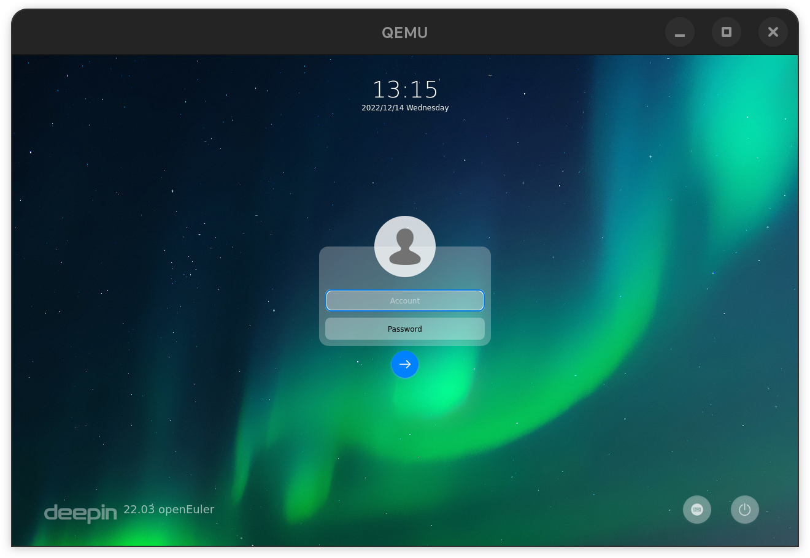
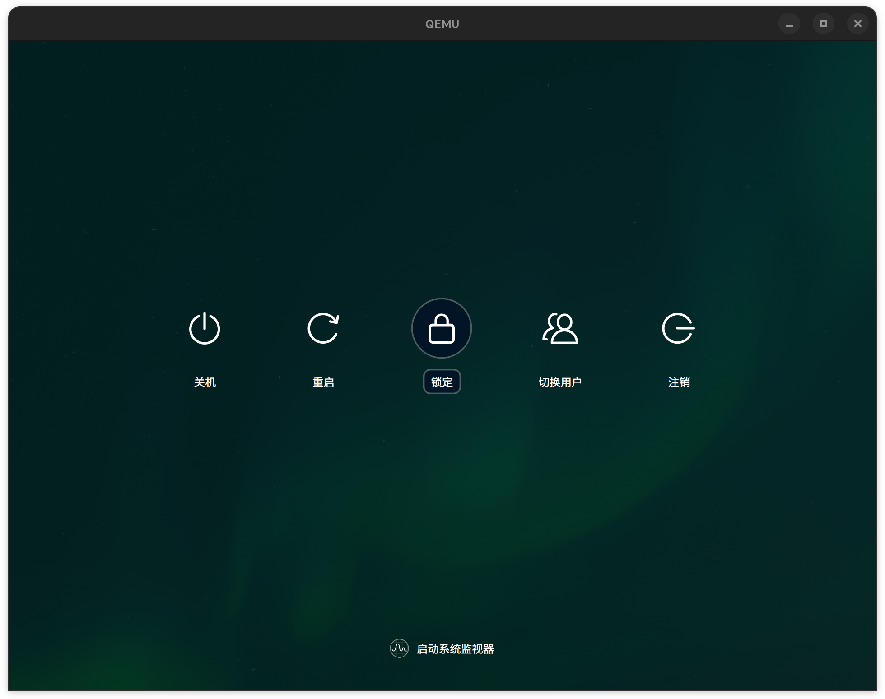
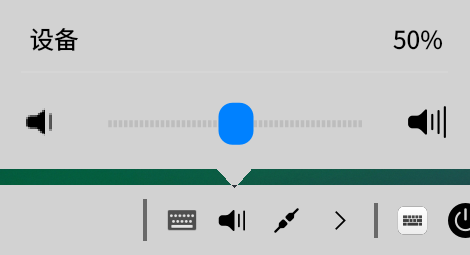
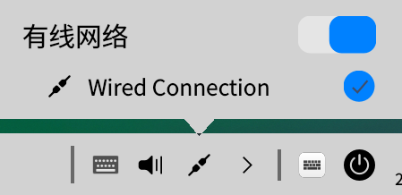
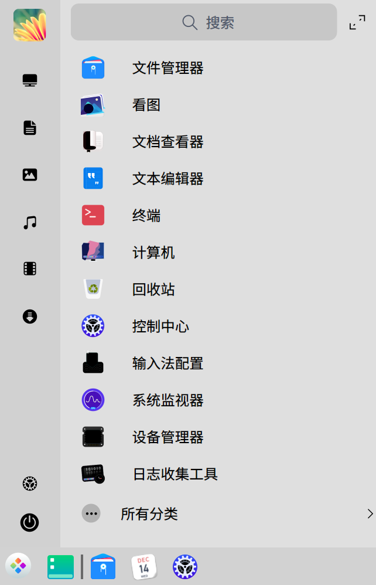
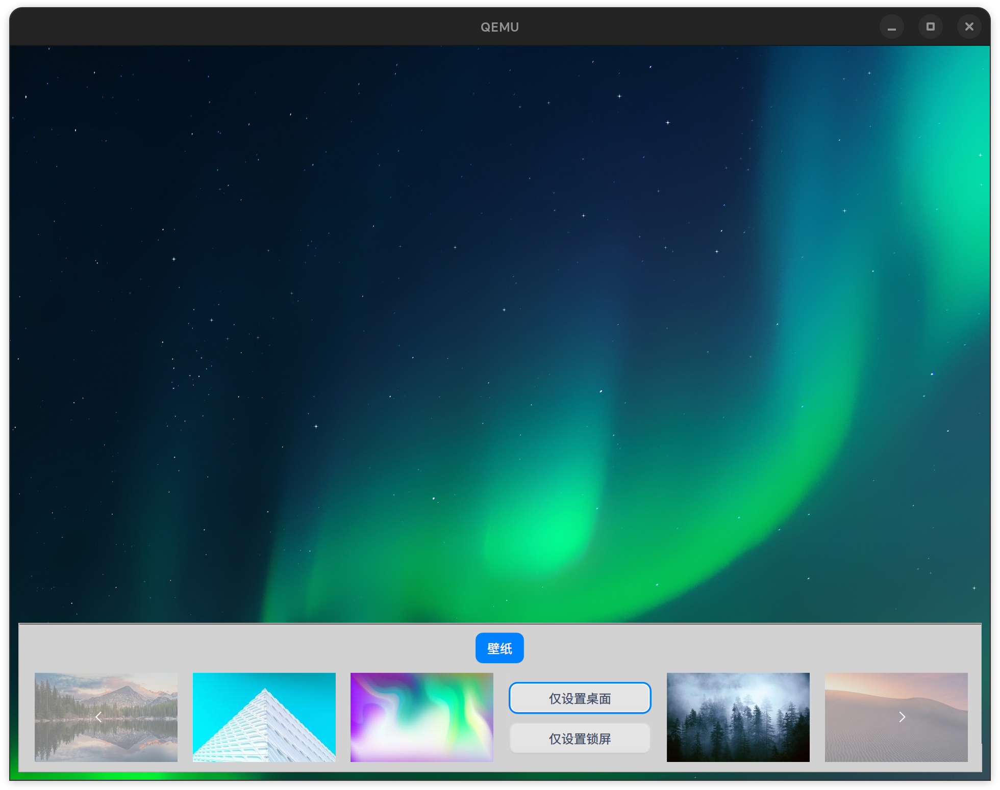
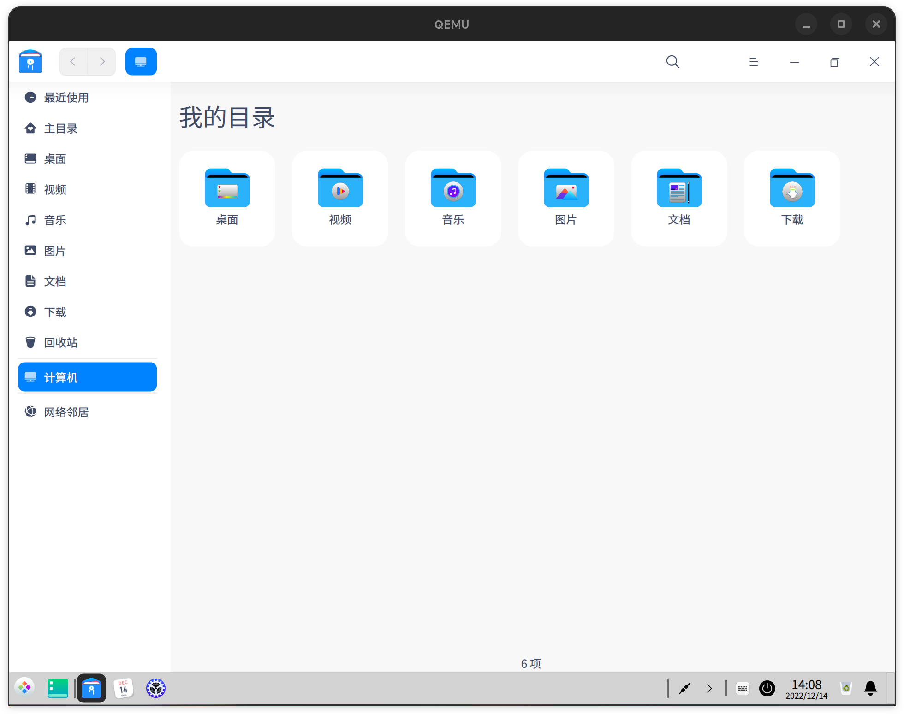

# DDE 使用说明

**初次安装完成时系统语言默认为英语。可通过以下步骤设置默认语言为 “简体中文”。**

1. 鼠标指针指向任务栏上的 “控制中心（Control Center）” 图标并点击鼠标左键，即可打开 “控制中心”；
2. 点击 “键盘和语言（Keyboard and Language）”；
3. 点击 “系统语言（System Language）”；
4. 点击窗口下方的 “+” 图标；
5. 在语言列表中找到 “简体中文” 并点击，然后点击 “添加”；
6. 点击 “语言列表（Language List）” 内的 “简体中文”，使其设为默认语言（在右侧显示 “” 标记）；
7. 点击 “编辑（Edit）”，然后点击 “American English（美式英语）” 旁的 “-” 图标删除，点击 “完成（Done）”；
8. 注销当前用户并重新登录。

> 由于不明原因的 bug，任务栏默认会显示在画面上方，即使它初始设置为显示在画面下方。

---

## 1. 系统 / 桌面的基本使用

Deepin 系统主要由以下界面元素构成：桌面、任务栏、启动器、窗口。

---

### 1.1 电源选项

#### 1.1.1 登录

1. 开机后点击需要登录的用户；
2. 点击密码输入框，输入该用户的密码；
3. 点击下方 “锁” 图标，或摁下 Enter 键确认登录。

#### 1.1.2 关机

1. 鼠标左键或者右键点击任务栏时间左侧的电源图标；
2. 在弹出的电源选项画面或菜单中，点击 “关机”；
3. 点击 “确定关机”。

#### 1.1.3 重新启动

1. 鼠标左键或者右键点击任务栏时间左侧的电源图标；
2. 在弹出的电源选项画面或菜单中，点击 “重启”；
3. 点击 “确定重启”。

#### 1.1.4 锁定

- 方法 1：

    1. 鼠标左键或者右键点击任务栏时间左侧的电源图标；
    2. 在弹出的电源选项画面或菜单中，点击 “锁定”。

- 方法 2：

    同时摁下键盘上的 Super 键与 L 键。

#### 1.1.5 注销

1. 鼠标左键或者右键点击任务栏时间左侧的电源图标；
2. 在弹出的电源选项画面或菜单中，点击 “注销”；
3. 点击 “确定注销”。

#### 1.1.6 切换帐户

测试此项操作前，操作系统内需要存在至少两个帐户。

1. 鼠标左键或者右键点击任务栏时间左侧的电源图标；
2. 在弹出的电源选项画面或菜单中，点击 “切换帐户”。

---

### 1.2 桌面图标

#### 1.2.1 打开桌面上的项目

1. 鼠标指针指向桌面内的任一项目（如 “计算机”）；
2. 双击鼠标左键，或点击鼠标右键，在弹出的菜单中，点击 “打开”。

#### 1.2.2 新建文件夹

1. 在桌面空白处点击鼠标右键；
2. 在弹出的菜单中，点击 “新建文件夹”；
3. 输入任意文件夹名称，鼠标左键点击桌面空白处，或摁下 Enter 键确认。

#### 1.2.3 新建文本文档

1. 在桌面空白处点击鼠标右键；
2. 鼠标指针指向 “新建文档”；
3. 在弹出的菜单中，点击 “文本文档”；
4. 输入任意文件名称，鼠标左键点击桌面空白处，或摁下 Enter 键确认。

---

### 1.3 任务栏

任务栏从左往右由以下五个部分组成：

1. “启动器” 图标、“显示桌面” 插件图标；
2. 应用程序，包括已经打开的以及驻留在任务栏的；
3. “系统托盘” 区域，显示当前系统状态及个别应用状态信息；
4. “其它插件” 区域，用于快速打开某些系统功能。
5. “速览桌面” 区域（仅适用于 “高效模式” 任务栏）。

#### 1.3.1 打开启动器

1. 鼠标指针指向任务栏最左侧；
2. 点击鼠标左键。

#### 1.3.2 显示桌面

若要隐藏所有窗口并切换到桌面，可执行以下任意一种操作：

- 点击任务栏 “启动器” 图标右侧的 “显示桌面” 图标；
- 点击鼠标左键 “速览桌面” 区域；
- 同时摁下键盘上的 Super 键与 D 键。

然后再次执行上述任意一种操作，可取消显示桌面并恢复原来的窗口状态。

#### 1.3.3 调整音量

1. 鼠标指针指向系统托盘区域内的 “音量” 图标；
2. 点击鼠标左键，在弹出的小窗口中，点击滑块区域中的空白位置，可快速跳转到相应音量值。
3. 鼠标指针指向滑块，然后摁住鼠标左键，可精确调节音量。
4. 点击小窗口左侧的 “小音量” 图标，可开关静音。
5. 若设备的键盘支持音量调节快捷键，亦可摁下相应的按键进行音量调节。

#### 1.3.4 网络连接

1. 鼠标指针指向系统托盘区域内的 “网络” 图标（如 “两根网线”、“Wi-Fi”）；
2. 点击鼠标左键，在弹出的小窗口中，点击网络类型名称右侧的开关，可启用或禁用对应网络类型。

---

### 1.4 启动器

#### 1.4.1 启动应用

1. 打开启动器；
2. 鼠标指针指向启动器应用列表内的任一项目（如 “Firefox”）；
3. 点击鼠标左键。

#### 1.4.2 搜索应用

1. 点击启动器上方的搜索框；
2. 在输入框中输入想要搜索的关键字。

---

### 1.5 文件、文件夹的操作

#### 1.5.1 以默认打开方式打开

1. 鼠标指针指向任一文件夹或文件；
2. 双击鼠标左键，或点击鼠标右键，在弹出的菜单中，点击 “打开”。

#### 1.5.2 以其它打开方式打开

1. 鼠标指针指向任一文件夹或文件；
2. 点击鼠标右键，在弹出的菜单中，鼠标指针指向 “打开方式”；
3. 在弹出的菜单中，点击需要使用的应用程序。

#### 1.5.3 剪切

1. 鼠标指针指向任一文件夹或文件；
2. 点击鼠标右键，在弹出的菜单中，点击 “剪切”；或点击鼠标左键选中该文件夹或文件后，同时摁下 Ctrl 键与 X 键；
3. 在 “文件管理器” 另一目录进行粘贴操作，该文件夹或文件则会被移动至该目录下。

#### 1.5.4 复制

1. 鼠标指针指向任一文件夹或文件；
2. 点击鼠标右键，在弹出的菜单中，点击 “复制”；或点击鼠标左键选中该文件夹或文件后，同时摁下 Ctrl 键与 C 键；
3. 在 “文件管理器” 另一目录进行粘贴操作，该文件夹或文件则会被复制至该目录下；若在同一目录进行粘贴操作，则会在同一目录下创建该文件夹或文件的副本。

#### 1.5.5 粘贴

测试此项操作前，系统剪贴板内的内容需为文件夹或文件。从其它编辑器应用中剪切或复制的文字、音频片段、图片等内容将无法已文件的形式粘贴。

1. 鼠标指针指向任一文件夹或文件；
2. 点击鼠标右键，在弹出的菜单中，点击 “复制”；或同时摁下 Ctrl 键与 V 键。

#### 1.5.6 重命名

1. 鼠标指针指向任一文件夹或文件；
2. 点击鼠标右键，在弹出的菜单中，点击 “重命名”；或点击鼠标左键选中该文件夹或文件后，点击该文件夹或文件的名称；
3. 输入任意新的文件夹或文件名称，鼠标左键点击桌面空白处，或摁下 Enter 键确认。

#### 1.5.7 删除

移动至回收站：

1. 鼠标指针指向任一文件夹或文件；
2. 点击鼠标右键，在弹出的菜单中，点击 “删除”；或点击鼠标左键选中该文件夹或文件后，摁下 Delete 键。

彻底删除文件：

1. 鼠标指针指向任一文件夹或文件；
2. 点击鼠标左键选中该文件夹或文件后，同时摁下 Shift 键与 Delete 键；
3. 在弹出的窗口中点击 “删除”。

#### 1.5.8 显示属性

1. 鼠标指针指向任一文件夹或文件；
2. 点击鼠标右键，在弹出的菜单中，点击 “属性”。

#### 1.5.9 创建链接

1. 鼠标指针指向任一文件夹或文件；
2. 点击鼠标右键，在弹出的菜单中，点击 “创建链接”；
3. 在弹出的窗口中，选择要将链接保存的目录；
4. 在 “文件名” 输入框中输入任意名称；
5. 点击 “保存” 或摁下 Enter 键确认。

#### 1.5.10 以管理员身份打开文件夹

1. 鼠标指针指向任一文件夹；
2. 点击鼠标右键，在弹出的菜单中，点击 “以管理员身份打开”；
3. 在弹出的窗口中，选择要使用管理员帐户的名称；
4. 点击密码输入框，输入该用户的密码；
5. 点击 “确定” 或摁下 Enter 键确认。

#### 1.5.11 在终端中打开文件夹

1. 鼠标指针指向任一文件夹；
2. 点击鼠标右键，在弹出的菜单中，点击 “在终端中打开”。

---

### 1.6 窗口

#### 1.6.1 最小化

对当前窗口进行最小化，鼠标指针指向窗口右上角的 “－” 图标并点击左键。

#### 1.6.2 最大化

对当前不处于最大化状态的窗口进行最大化，鼠标指针指向窗口右上角的 “□” 图标并点击左键。

#### 1.6.3 还原

对当前处于最大化状态的窗口进行还原小窗口，鼠标指针指向窗口右上角的 “” 图标并点击左键。

#### 1.6.4 关闭

关闭当前窗口，可执行以下任意一种操作：

- 鼠标指针指向窗口右上角的 “×” 图标并点击左键；
- 同时摁下 Alt 键和 F4 键。

#### 1.6.5 移动

若要移动一个窗口的位置，鼠标指针指向窗口标题栏空白区域或标题，摁住鼠标左键并拖动鼠标，当窗口到达目标位置后，松开鼠标左键。

#### 1.6.6 更改大小

若要更改一个窗口的大小，鼠标指针指向窗口边缘，摁住鼠标左键并拖动鼠标，当窗口到达目标大小后，松开鼠标左键。

---

### 1.7 壁纸

1. 在桌面空白处点击鼠标右键；
2. 在弹出的菜单中，点击 “设置壁纸”；
3. 点击任意图片缩略图；
4. 选择将该壁纸应用到 “桌面”、“锁屏”。

若要使用自己的图片作壁纸，执行以下操作：

1. 鼠标指针指向任一图片文件；
2. 点击鼠标右键，在弹出的菜单中，点击 “设置壁纸”。

---

## 2. 系统预置应用的使用

---

### 2.1 文件管理器

鼠标指针指向任务栏上的 “文件管理器” 图标并点击鼠标左键，即可打开 “文件管理器”。

#### 2.1.1 浏览目录与文件

在窗口的左侧，列出了一些常用的目录的名称，可用鼠标左键点击它们来查看该目录内的文件夹和文件。

在窗口的右侧，列出当前目录下所有的文件夹和文件，可用鼠标左键双击它们来打开想要查看的内容。

窗口左上方的 “<”（后退）与 “>”（前进）图标可用于控制查看上一个或下一个浏览过的目录。

窗口上方列出了当前目录的所有上级目录，可以点击其中一个目录名称，快速返回到该上级目录。

#### 2.1.2 文本地址栏与搜索框

点击窗口上方的 “放大镜” 图标可以显示文本地址栏与搜索框。

若要通过路径打开指定目录，可在输入框中输入完整路径（如 “/data/home”），然后摁下 Enter 键跳转到该目录。

在搜索框输入关键字，即可搜索当前目录下含有该关键字的文件夹和文件。若要在所有目录进行搜索想要的内容，需先切换到 “计算机” 目录。

#### 2.1.3 最近使用记录

通过 “文件管理器” 或桌面打开过的文件，会出现在 “文件管理器” 的 “最近使用” 内。可在 “最近使用” 管理最近打开过的文件。

---

### 2.2 终端

打开启动器，找到 “终端” 并点击，即可打开 “终端”。

在 “终端” 的窗口中，可测试一些常用的命令。如：

ls -la
cd /home

---

## 3. 控制中心

鼠标指针指向任务栏上的 “控制中心” 图标并点击鼠标左键，即可打开 “控制中心”。

---

### 3.1 帐户

点击控制中心内的 “帐户” 切换到帐户设置。

#### 3.1.1 创建帐户

点击窗口下方的 “+” 图标创建帐户。在窗口的右侧，填写新帐户的名称和密码。然后点击 “创建”。

#### 3.1.2 删除帐户

点击要删除的帐户的名称。在窗口的右侧，点击 “删除帐户”。在弹出的窗口中，选择是否同时删除帐户目录，然后点击 “删除”。

---

### 3.2 显示

点击控制中心内的 “显示” 切换到显示设置。

#### 3.2.1 屏幕缩放

点击 “屏幕缩放”，拖动 “屏幕缩放” 右侧的滑块，即可调整画面显示的所有元素（如文字、图标、窗口）的整体大小。

#### 3.2.2 显示分辨率

点击 “分辨率” ，点击右侧任一分辨率即可切换相应的分辨率。

在弹出的菜单中，点击 “保存” 保存设置，点击 “还原” 可恢复到之前的分辨率。若无任何操作，则在 15 秒后自动选择 “还原”。
